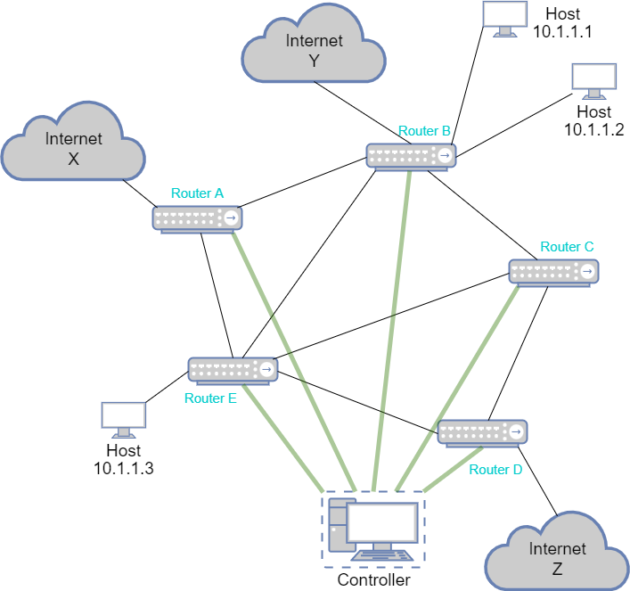

# Lab3

在 Lab 3 中，你需要实现一个简单的运行 DV 算法并支持 NAT 功能的路由器。

## 1. 网络结构

在 Lab 3 中，我们对网络拓扑进行了简化，如下图所示



若干路由器之间以任意方式连接成图，每个路由器只能有最多一个内网端口，但可以有多个与其相连的 host。为了简单起见，每台 host 均有唯一的 IP 地址且只能连接一台路由器，而路由器不具有 IP 地址。网络中存在一个用于 Lab 测试的 Controller 节点，它与每台路由器均相连。 

我们仅考虑路由器之间的连接权值，并将其余部分的 cost 均设为 0.

> 注意，这里定义的网络结构与现实中的结构并不相同。


## 2. 功能要求

这一节将概括性的描述你需要实现的路由器功能。

你实现的路由器程序将被部署到每一台路由器上。总的来说，它需要支持在接收到一个报文后，根据目的地址决定转发到哪一个端口，另外需要实现网络地址转换 (NAT) 以支持内网对公网的访问。

### 2.1. 路由算法

我们希望你的路由器程序使用距离矢量算法，因为之后的接口设计将基于这一假设。你的路由器应当能够通过不断地信息交换最终得到到达任意可达 host 的最短路径，特别地，你也应该能够得出到达经过 NAT 转换后的地址的最短路径。

路由器在收到数据报文时应当按照计算得到的最短路径进行转发。

### 2.2. NAT

另一方面，对于存在内网端口的路由器，它需要支持最基础的 NAT 功能，在 Lab 3 中，它包括：

1. 每个路由器需支持配置最多 256 个可用公网地址。
2. 对于源地址为内网地址的报文，若该源地址尚未分配公网地址，则需要为该源地址分配一个可用公网地址，并在转发前将报文中的内网地址替换为对应公网地址。
3. 对于收到的报文，应当检查目的地址是否是该路由器的可用公网地址，若是，**则检查是否为 2 中已分配的地址**，若是则将其替换为对应的内网地址并转发到内网端口，若不是已分配的地址，则丢弃该报文。

**注意，本 Lab 中并没有对连接状态进行检查**。

### 2.3 Controller

你不需要实现 Controller，但为了进行测试，你需要能够接收来自 Controller 的控制信息，并作出相应的操作。我们将在下一节中具体描述控制信息的内容。

## 3. 技术规范

### 3.1. 报文格式

在 Lab 3 中，每一个报文仅包含一个报头，其格式如下：

```cpp
struct {
    uint32_t    src;
    uint32_t    dst;
    uint8_t     type;
    uint16_t    length;
};
```

`src` 和 `dst` 字段分别表示源和目的 IPv4 地址。

`length` 字段为报头后的 payload 长度。

`type` 字段有三个取值，分别为 `TYPE_DV` , `TYPE_DATA` 和 `TYPE_CONTROL` 。其值分别为

```cpp
uint8_t TYPE_DV         = 0x00;
uint8_t TYPE_DATA       = 0x01;
uint8_t TYPE_CONTROL    = 0x02;
```

对于 `TYPE_DATA` ，其后仅包含数据。路由器应当转发该种报文，并且保持 payload 不变，测试时将会检查 payload 。

对于 `TYPE_DV` ，该种报文用于允许在路由器之间交换距离向量，你可以自己定义其后的 payload 格式和内容。另外，路由器收到该类型报文时的行为也是自定义的，测试时将不会检查该类型报文的内容。

对于 `TYPE_CONTROL` ，该种报文仅由 Controller 发出，其 payload 包含一条指令**字符串** 。

**注意，`src` 与 `dst` 字段为大端法表示，其余字段均为小端法表示**

### 3.2. 控制指令

控制指令是包含在 CONTROL 报文中的**字符串**。

每条控制指令形如 `<type> <param1> ...` ，其中 `<type>` 为整数，用于指示该条指令的类型。

你的路由器需要支持的控制指令如下：

|  command          | `<type>`  |
|  ----             | ----      |
| TRIGGER DV SEND   |  0     |
| RELEASE NAT ITEM  |  1     |
| PORT VALUE CHANGE |  2     |
| ADD HOST          |  3     |

注意该表给出了每个类型对应的 `<type>` 字段的值。

#### 3.2.1. TRIGGER DV SEND

该指令仅包含 `<type>` ，路由器应当在收到该指令后主动发起一次距离向量交换。

#### 3.2.2 RELEASE NAT ITEM

该指令格式为 `<type> <internal_ip>` ，其中 `<internal_ip>` 为一个点分十进制表示的内网 IPv4 地址，一条合法的指令例如 `1 10.0.0.0` 。路由器在收到该指令后，应当将 `<internal_ip>` 拥有的已分配公网地址释放，该内网地址不再拥有公网地址直到再次被分配。

#### 3.2.3 PORT VALUE CHANGE

该指令格式为 `<type> <port> <value>` ，其中 `<port>` , `<value>` 均为整数值，一条合法的指令例如 `2 5 6` 。该条指令意为将路由器的 `<port>` 端口的权值更新为 `<value>` 。路由器在收到该指令后，应当更新端口对应的权值。

**特别的， `<value>` 为 `-1` 时意为该端口被关闭**。

#### 3.2.4 ADD HOST

该指令格式为 `<type> <port> <value> <ip>` ，其中 `<port>` , `value` 为整数值， `ip` 为一个点分十进制表示的公网地址，一条合法的指令例如 `3 2 10 114.114.114.114` 。该条指令通知路由器在 `<port>` 端口上连接了一台 IPv4 地址为 `<ip>` 的 host，链路 cost 为 `<value>` 。路由器收到该指令后应该更新路由。

## 4. 实现要求

### 4.1. 路由器接口

为了避免多进程引入的不确定性以方便调试和测试，我们要求你必须按照给定的接口实现你的路由器程序。

具体来讲，在下发文件的 `router_prototype.h` 中定义了抽象类 `RouterProto` 

```cpp
class RouterProto {
public:
    virtual void router_init(int port_num, int internal_port, char* internal_addr, char* external_addr) = 0;
    virtual int router(int in_port, char* packet) = 0;
};
```

**你实现的 router 必须继承该抽象类并实现上述两个虚函数**。

#### 4.1.1. `router_init`

`router_init` 函数用于初始化路由器状态，其包含四个参数

+ `port_num` 表示该路由器的端口数，保证 `port_num` 大于 `0` 
+ `internal_port` 表示该路由器的内网所在端口，若 `interlal_port = 0` 则表示该路由器没有连接内网
+ `internal_addr` 表示该路由器的内网对应的地址范围，其使用 CIDR 进行表示，例如 `10.0.0.0/24` 表示的地址范围为 `10.0.0.0` 到 `10.0.0.255` 
+ `external_addr` 表示该路由器的可用公网地址范围，表示方式同 `internal_addr` 

简单起见，我们约定 `internal_addr` 和 `external_addr` 最多包含 256 个地址。

**另外，我们约定端口号从 1 开始编号。特别地，每个路由器的 1 号端口均与 Controller 连接。**

在初始化时，路由器仅有 **1** 号端口和内网端口处于开启状态。

#### 4.1.2 `router`

`router` 函数规定了路由器转发报文的接口，其包含两个参数

+ `in_port` 表示收到的报文的入端口号
+ `packet` 表示收到的报文，其满足 3.1 中的格式

该函数接收一个报文，处理后最多返回一个报文，返回的报文仍然保存在 `packet` 中。

函数的返回值表示返回的报文应该转发到的端口号，特别地
+ 返回值为 `0` 表示该报文应当被广播到所有相邻路由器
+ 返回值为 `-1` 表示路由器丢弃了报文，因而没有返回报文
+ 返回值为 `1` 表示将报文转发给默认网关，我们用 Controller 充当默认网关，当路由器中没有目标地址的路由时，应当将数据报文转发到默认网关

**注意，不要在 `router()` 中释放 `packet`**

另外，每个报文的总长度 (header + payload) 不应该超过 8192 ，我们使用了较大的报文长度以确保你不需要使用多个报文来发送距离向量。如果这个限制仍然太小，那么你应该考虑更改实现方式。

### 4.2. 控制器工作流

你可以在 `RouterProto` 规定的框架下以自己喜欢的方式实现 `router_init` 和 `router` ，但你的实现需要考虑到 Controller 对 `RouterProto` 的调用方式。

Controller 通过创建多个 router 实例来模拟实机环境。为了使 Controller 能够创建你定义的 router 类，我们在 `router_prototype.h` 中声明了一个辅助函数

```cpp
RouterProto* create_router_object();
```

**你应该实现该函数使其创建一个你定义的 router 类对象并返回其指针**。

Controller 将首先通过 `create_router_object` 创建 router 对象，紧接着调用 `router_init` 完成初始化。

Controller 基于如下逻辑运行：

``` cpp
test()
{
    # craete router objects and call router_init()
    # generate some control packet
    # send packets to routers through router() and forward returned packet
    # wait until no packet is forwarding
    # generate some data packet
    # trace data packet forwarding 
    # check if data packets is correctly forwarded
}
```

一般情况下，你的路由器应当采用 DV 算法因此并不需要关心 `router()` 被调用的顺序，但你可以认为 `router()` 的调用具有如下顺序

``` cpp
while(1) {
    # for each router:
       # call router() once if has packet in ingress queue
       # forward the output to ingress queue of corresponding routers       
}
```


### 4.3. 测试要求

> 相信你一定发现了 Lab 3 存在明显的漏洞，虽然我们希望你按照要求实现，但我们并不阻止你利用漏洞。

> 如果你没有按照文档中的标准进行实现，我们将人工评估你的实现方式与标准实现的工作复杂性差距，如果你的实现方式**非常优雅而又具有一定的复杂性**，我们将不会判定为不符合要求。

> 但请注意，**任何修改 Controller 的行为将被视为违规，本次 Lab 记 0 分**。

测试将主要分为两个部分，分别检查路由算法和 NAT 的功能实现是否正确。

你可以认为测试时将主要存在两种操作，修改和查询。**测试程序保证在发生修改后的查询开始前会向所有路由器发送 `TRIGGER DV SEND` 报文，并等待到网络稳定后再开始查询**。

#### 4.3.1. 路由算法

对于路由算法，我们将仅检测

1. 转发功能，即路由器能否正确转发报文
2. 可达性，即连通的情况下，从 host A 发出的报文能否正确到达 host B 
3. 最优路径，即在 1 满足的前提下，路由路径的长度是否等于最短路径长度
4. 动态路由，即在网络拓扑变化的情况下能否正确计算得到最有路由

你可以自由设计 DV 算法的实现方式，我们不会检查路由器上的距离向量表以及交换的 `DV` 报文。 

#### 4.3.2. NAT

对于 NAT ，我们将检测

1. 是否满足 2.2 中的功能要求
2. 动态地址分配是否正确

你可以自由选择 NAT 的实现方式，在本 Lab 中，你只应该在收到 `RELEASE NAT ITEM` 报文时释放可用公网地址。

## 5. 本地测试

你可以在本地编译生成 `test_client` 来进行本地测试。为了便于调试，我们提供了 debug 模式。下发文件中提供了 CMake 模板，你可以修改 CMakeList.txt 文件以新增源文件。
 

### 5.1 debug mode

你可以通过执行 `./test_client 0` 来运行 debug 模式。在该模式下，你可以认为 `test_client` 提供了一个运行 `controller` 与 `router` 的模拟器，你可以通过以下指令进行调试

1. `new <port_num> <internal_port> <internal_addr> <external_addr>` 创建一个新的路由器，参数与 `router_init()` 的参数一致， `test_client` 将会返回创建的路由器的编号（正整数） 。该指令将会创建 router 实例并调用 `router_init()` 
2. `link <router_id> <router_id> <weight>` 连接由 1 中返回的路由器编号指定的两个路由器，权值必须为非负整数，端口号将由 controller 选择。该指令将会向两个路由器分别发送一条 `CHANGE PORT WEIGHT` 报文
3. `cut <router_id> <router_id>` 断开两个路由器之间的连接。该指令将会向两个路由器分别发送一条 `<value>` 为 -1 的 `CHANGE PORT WEIGHT` 报文 
4. `weight <router_id> <router_id> <weight>` 修改两个路由器之间的连接权值。该指令将会向两个路由器分别发送一条 `CHANGE PORT WEIGHT` 报文
5. `addhost <router_id> <addr>` 在对应路由器上连接一台 host ，其 ip 地址为 `<addr>` 。该指令将会向路由器发送一条 `ADD HOST` 报文
6. `delhost <addr>` 删除地址为 `<addr>` 的 host 。该指令会向对应路由器发送一条 `CHANGE PORT WEIGHT` 报文
7. `trigger` 向所有路由器发送一条 `TRIGGER DV SEND` 报文
8. `n` 使所有路由器收入一个包并执行一次转发
9. `ns` 不断执行 8 直到网络中不再有报文转发
10. `hostsend <src_addr> <dst_addr> <payload>` 从 host `<src_addr>` 发送一条目的地址为 `<dst_addr>` 的数据报文， `<payload>` 为可选字段。将会返回路径长度与最后一跳报文的 src, dst, payload 
11. `intersend <router_id> <src_addr> <dst_addr> <payload>` 从路由器的内网发送一条数据报文，源地址必须为内网地址， `<payload>` 为可选字段。将会返回路径长度与最后一跳报文的 src, dst, payload 
12. `exit` 退出程序

**注意，上述指令中 2-7 发送的报文仅发送到路由器的输入队列，而没有调用 `router()` ，只有当执行 8/9 时才会调用 `router()` 。而 10/11 则会立即调用 `router()` 并递归跟踪转发路径**。

一个运行时的例子可以参考
``` txt
new 4 2 10.0.0.0/24 117.117.117.0/24
new 3 0 0 0
link 1 2 5
addhost 1 192.168.0.0 2
addhost 2 192.168.0.1 4
trigger
ns
hostsend 192.168.0.0 192.168.0.1 Hello
hostsend 192.168.0.1 117.117.117.0 Hi
intersend 1 10.0.0.0 192.168.0.1 Hello
hostsend 192.168.0.1 117.117.117.0 Hi
```

### 5.2 test mode

你可以通过执行 `./test_server` 来运行本地测试。你可以通过参数指定特定测试点进行测试，详情可以参考 Lab 1 。

## 6. 分数计算

本次Lab总分 xxx 分

部分测试点在 Deadline 前放出，全部测试点会在 Deadline 后统一进行测试。我们会在数据点内容中详细描述所有测试点的测试内容。

同学们可以通过 Github 进行自动化测试（Deadline 前只会看到满分为 xxx 分）。